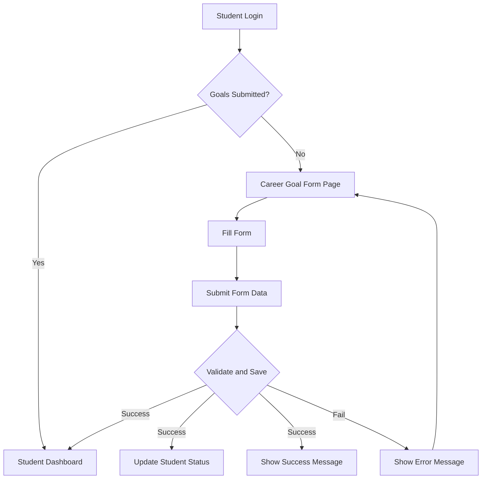
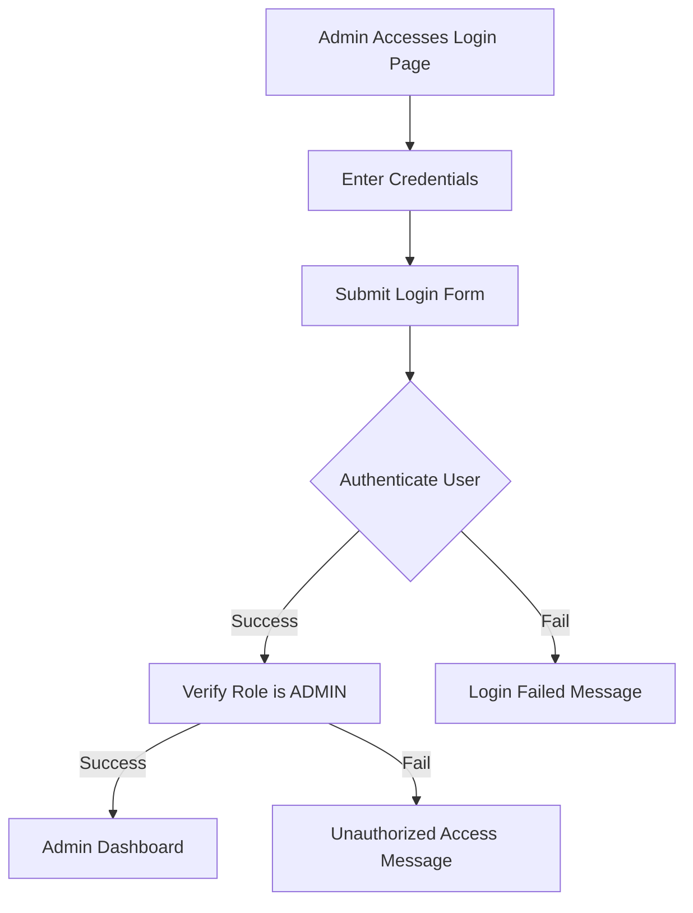
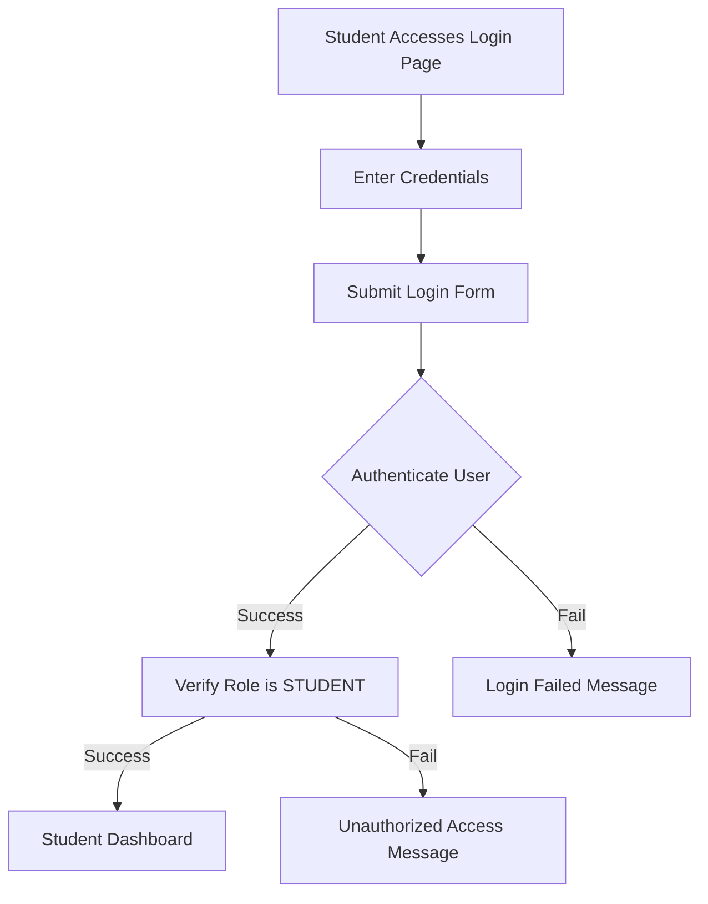
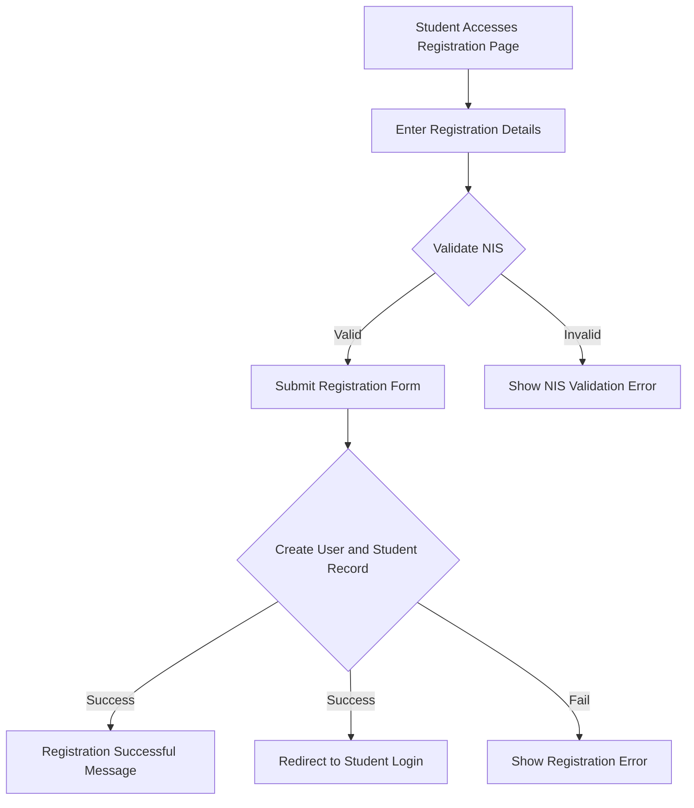
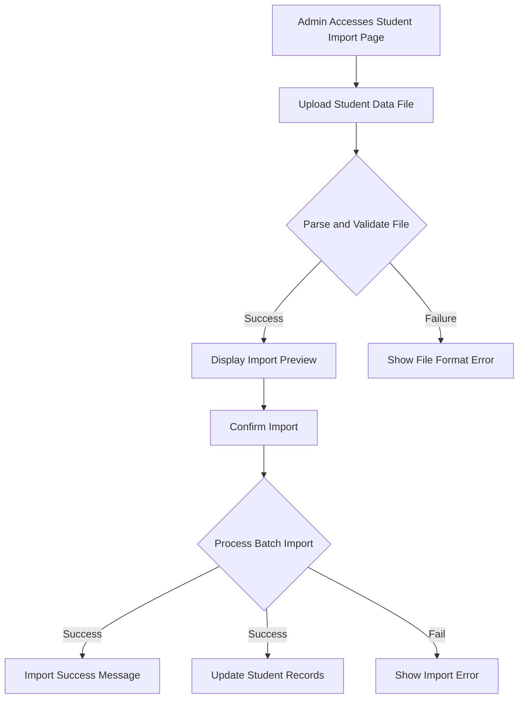
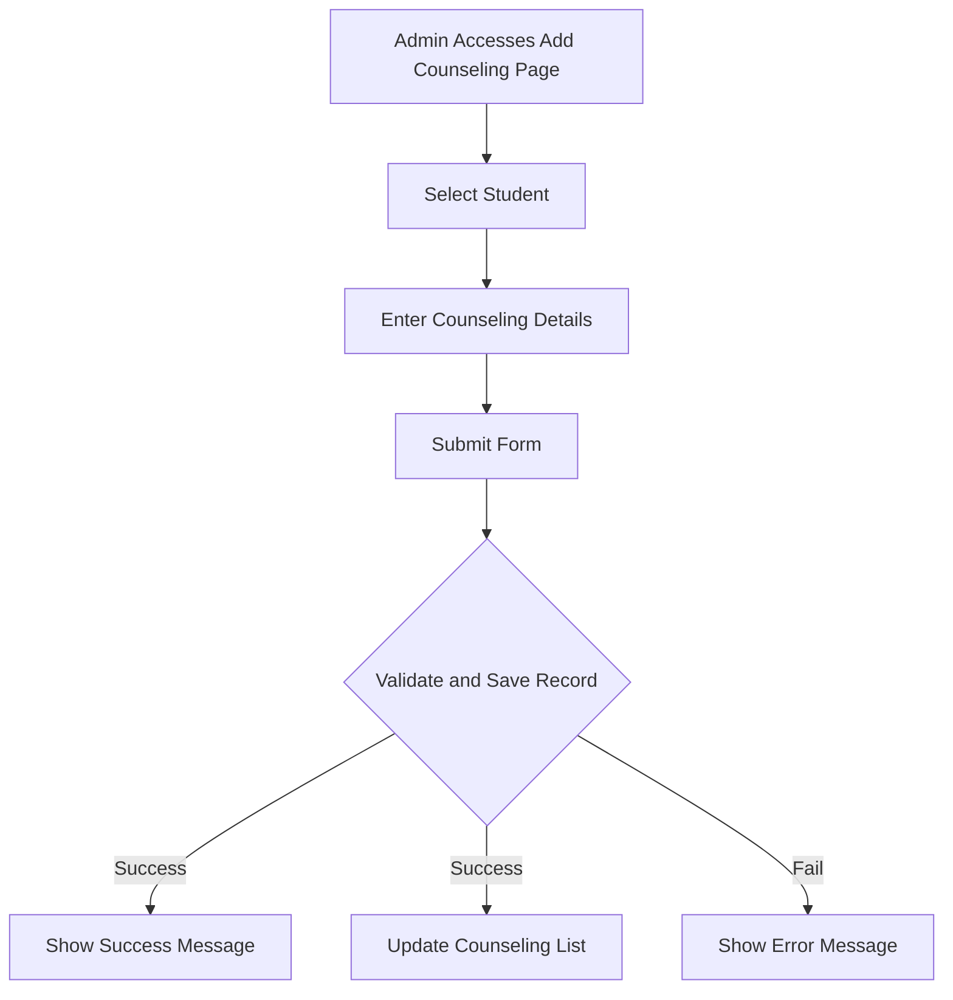

# ITXPro Career Counseling Application Documentation

## I. Introduction

This document provides comprehensive documentation for the ITXPro Career Counseling Application, a platform designed to facilitate career guidance for students and to streamline administrative processes for counselors.

### Purpose of the Application

The ITXPro Career Counseling Application aims to bridge the gap between students seeking career guidance and the administrative staff responsible for managing counseling activities. It provides a structured environment for students to explore and define their career aspirations, while offering powerful tools for administrators to track, manage, and analyze counseling sessions and student career data.

### Target Audience

*   **Students:** Individuals seeking guidance in defining their career paths, managing their academic and professional goals, and reviewing their counseling history.
*   **Counselors/Administrators:** Staff responsible for conducting counseling sessions, managing student data, tracking career goals, and generating reports on counseling activities.

## II. Features Overview

The application offers a dual interface tailored for both students and administrators, providing a holistic approach to career counseling.

*   **Authentication & Authorization:** Secure login and registration processes for both student and admin roles.
*   **Admin Module:** A comprehensive suite of tools for counselors to manage student data, counseling sessions, and generate insightful reports.
*   **Student Module:** A personalized dashboard for students to manage their career goals, view counseling history, and update their profiles.
*   **General/Public Pages:** Informative pages providing an overview of the application and contact details.

## III. Core Features

### A. Authentication & Authorization

This section details the secure access mechanisms for both user roles within the application.

*   **Admin Login:**
    *   **Purpose:** Securely authenticates administrators to access the administrative dashboard and tools.
    *   **Functionality:** Administrators provide credentials to gain access. Role-based access control ensures only authorized users can access admin features.
    *   **Key Components:** [`app/auth/admin/page.tsx`](app/auth/admin/page.tsx) (frontend), [`app/api/auth/[...nextauth]/route.ts`](app/api/auth/[...nextauth]/route.ts) (backend API endpoint), `next-auth` library for session management.

*   **Student Login:**
    *   **Purpose:** Securely authenticates students to access their personalized dashboards and career management tools.
    *   **Functionality:** Students provide credentials to log in.
    *   **Key Components:** [`app/auth/student/page.tsx`](app/auth/student/page.tsx) (frontend), [`app/api/auth/[...nextauth]/route.ts`](app/api/auth/[...nextauth]/route.ts) (backend API endpoint), `next-auth` library.

*   **Student Registration:**
    *   **Purpose:** Allows new students to create an account and register within the system.
    *   **Functionality:** Students provide necessary information to register. Includes validation for Student Identification Number (NIS).
    *   **Key Components:** [`app/auth/student/register/page.tsx`](app/auth/student/register/page.tsx) (frontend), [`app/api/auth/register/route.ts`](app/api/auth/register/route.ts) (backend API endpoint), [`app/api/auth/validate-nis/route.ts`](app/api/auth/validate-nis/route.ts) (NIS validation API).

*   **Password Management:**
    *   **Purpose:** Enables students to update their account passwords.
    *   **Functionality:** Students can change their password through a dedicated interface.
    *   **Key Components:** [`app/api/student/update-password/route.ts`](app/api/student/update-password/route.ts) (backend API endpoint).

### B. Admin Module

The administrative module provides comprehensive tools for managing counseling processes and student data.

*   **Dashboard:**
    *   **Purpose:** Provides a centralized overview of key metrics and activities related to counseling and student career goals, enabling administrators to quickly grasp the overall status and identify areas requiring attention.
    *   **Functionality:** Displays a variety of statistics and summaries, including:
        *   **Total Counseling Sessions:** A count of all counseling sessions recorded in the system.
        *   **Counseling Session Trends:** Monthly breakdown of counseling sessions, showing activity over time.
        *   **Career Goal Distribution:** Visual representation of students' primary career aspirations, categorized for easy analysis.
        *   **Student Batch Distribution:** Breakdown of students by their current class or batch, providing demographic insights.
        *   **Students Not Submitted Career Goals:** A list and count of students who have not yet submitted their career goals, allowing for targeted follow-ups.
        *   **Counseling Statistics by Class:** Metrics on counseling engagement per class, showing the number of unique students counseled.
        *   **Quick Actions:** Shortcuts to frequently used administrative tasks, such as adding a new counseling record or importing student data.
        *   **Recent Activity:** A log of recent interactions and changes within the system, providing an audit trail.
        *   **Student List Overview:** A summarized list of registered students.
        *   **Counseling List Overview:** A summarized list of counseling sessions.
    *   **Key Components:** [`app/admin/dashboard/page.tsx`](app/admin/dashboard/page.tsx) (frontend dashboard page), [`app/api/admin/dashboard/route.ts`](app/api/admin/dashboard/route.ts) (backend API for fetching general dashboard statistics), [`app/api/admin/konseling/stats/route.ts`](app/api/admin/konseling/stats/route.ts) (backend API for comprehensive counseling and career goal statistics), various UI components in `components/admin/dashboard/` (e.g., `StatisticsCard`, `StatisticsView`, `KonselingList`, `StudentList`, `QuickActions`, `RecentActivity`, `CareerManagement`).

*   **Student Management:**
    *   **Purpose:** Facilitates the administration and management of student records.
    *   **Functionality:**
        *   **View Student Details:** Counselors can access individual student profiles, including their academic information and counseling history.
        *   **Import Students:** Supports bulk import of student data, streamlining the onboarding process for new cohorts.
    *   **Key Components:** [`app/admin/student/[id]/page.tsx`](app/admin/student/[id]/page.tsx) (frontend for student details), [`app/api/admin/siswa/route.ts`](app/api/admin/siswa/route.ts) (API for student list/creation), [`app/api/admin/student/[id]/route.ts`](app/api/admin/student/[id]/route.ts) (API for individual student management), [`app/api/admin/siswa/import/route.ts`](app/api/admin/siswa/import/route.ts) and [`app/api/admin/siswa/confirm-import/route.ts`](app/api/admin/siswa/confirm-import/route.ts) (APIs for student import).

*   **Counseling Management:**
    *   **Purpose:** Enables administrators to manage all aspects of counseling sessions.
    *   **Functionality:**
        *   **View Counseling Records:** Admins can retrieve a paginated list of counseling records. Supports filtering by search term (student name, NIS, counseling text), category, status, student's current class, and date range. Each record includes student details (NIS, name, current class, batch).
        *   **Create New Counseling Records:** Admins can add new counseling records for individual students, capturing details like date, outcome, description, follow-up actions, and category. Validates if the student exists.
        *   **Batch Counseling Operations:** Efficiently create multiple counseling records for a group of students simultaneously, useful for group counseling sessions or mass data entry.
        *   **Counseling Statistics:** Provides comprehensive statistics on counseling activities, including total sessions, categorization, and class-wise metrics.
    *   **Key Components:**
        *   [`app/api/admin/konseling/route.ts`](app/api/admin/konseling/route.ts) (API for fetching and creating counseling records).
        *   [`app/api/admin/konseling/[id]/route.ts`](app/api/admin/konseling/[id]/route.ts) (API for updating individual counseling records).
        *   [`app/api/admin/konseling/batch/route.ts`](app/api/admin/konseling/batch/route.ts) (API for batch creation of counseling records).
        *   [`app/api/admin/konseling/stats/route.ts`](app/api/admin/konseling/stats/route.ts) (API for comprehensive counseling statistics).

*   **Career Goal Management (Admin View):**
    *   **Purpose:** Provides administrators with an overview of students' declared career goals.
    *   **Functionality:** Admins can view aggregated or individual student career aspirations.
    *   **Key Components:** [`app/api/admin/tujuan-karir/route.ts`](app/api/admin/tujuan-karir/route.ts) (API for viewing career goals).

### C. Student Module

The student module offers personalized features for career planning and tracking.

*   **Dashboard:**
    *   **Purpose:** Serves as the student's personalized homepage, providing a quick overview of their counseling journey and career goal status.
    *   **Functionality:**
        *   **Counseling History:** Displays a chronological record of all past counseling sessions the student has participated in, including dates, outcomes, and any follow-up actions.
        *   **Career Goal Status:** Shows whether the student has submitted their career goals, and provides a direct link to the career goal submission/viewing page.
    *   **Key Components:** [`app/student/dashboard/page.tsx`](app/student/dashboard/page.tsx) (frontend dashboard page), [`app/api/student/dashboard/route.ts`](app/api/student/dashboard/route.ts) (backend API for fetching student-specific dashboard data, including counseling history and career goal status).

*   **Career Goal Management:**
    *   **Purpose:** Enables students to define, submit, and review their career aspirations.
    *   **Functionality:** Students can formally record their career aspirations, selecting a main category and providing specific details (e.g., university choices, major, details for working or entrepreneurship). The system ensures that career goals are submitted once.
    *   **Key Components:** [`app/student/tujuan-karir/page.tsx`](app/student/tujuan-karir/page.tsx) (frontend), [`app/api/student/tujuan-karir/route.ts`](app/api/student/tujuan-karir/route.ts) (backend API for submitting career goals).

*   **Profile View:**
    *   **Purpose:** Allows students to view their personal information.
    *   **Functionality:** Students can access their own profile details.
    *   **Key Components:** [`app/student/[id]/page.tsx`](app/student/[id]/page.tsx) (frontend), [`app/api/student/[id]/route.ts`](app/api/student/[id]/route.ts) (backend API for student details).

### D. General/Public Pages

These pages provide general information about the application.

*   **Landing Page:**
    *   **Purpose:** The entry point for all users, providing an overview and calls to action.
    *   **Key Components:** [`app/page.tsx`](app/page.tsx).

*   **About Page:**
    *   **Purpose:** Provides information about the application, its mission, and objectives.
    *   **Key Components:** [`app/tentang/page.tsx`](app/tentang/page.tsx).

*   **Contact Page:**
    *   **Purpose:** Provides contact information for support or inquiries.
    *   **Key Components:** [`app/kontak/page.tsx`](app/kontak/page.tsx).

## V. Usage Diagrams

### Student Career Goal Submission Flow


**Note on API Endpoint:** The form submission in step F/G interacts with `POST /api/student/tujuan-karir`.

### Admin Login Flow



### Student Login Flow



### Student Registration Flow



### Admin Student Import Flow



### Admin Add Counseling Record Flow



### Student Dashboard View Flow

```mermaid
graph TD
    A[Student Logs In] --> B[Access Student Dashboard];
    B --> C[Fetch Counseling History];
    C --> D[Display Counseling History];
    B --> E[Fetch Career Goal Status];
    E --> F[Display Career Goal Status];